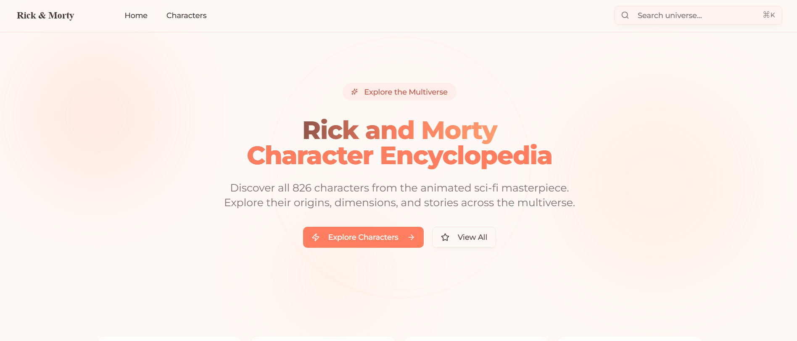
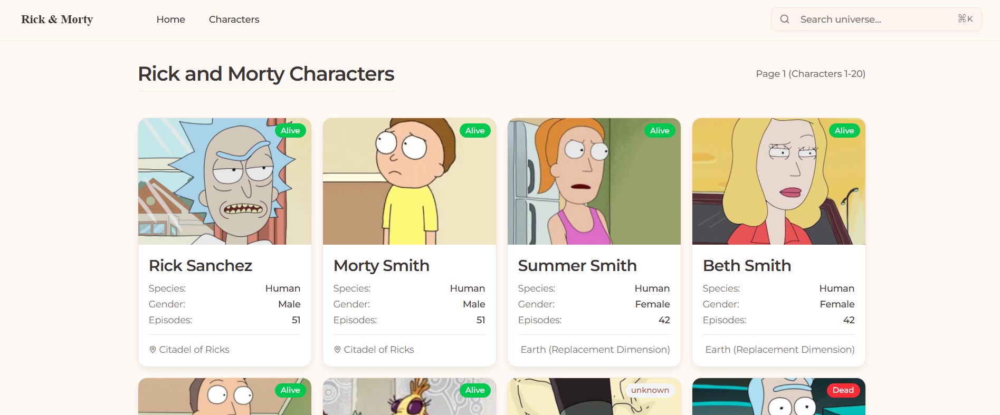

# Rick and Morty App





### Strategy
For the database creation, I had two options regarding the Rick and Morty characters:
1. Prefetch all characters and seed the database initially.
2. Fetch and store them in the database on demand (lazy loading).

I chose the second option because it presented a greater challenge and allowed me to extensively test different Convex functions and capabilities.

## Getting Started

To run this project locally:

1. Install dependencies:
   ```bash
   npm install
   ```

2. Run the development server (frontend and backend):
   ```bash
   npm run dev
   ```

   This will start the Next.js frontend and the Convex backend.
